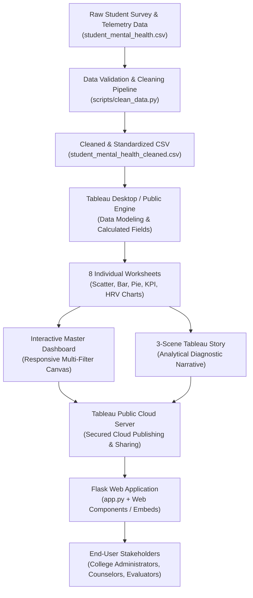

# Project Architecture: Student Mental Health Analytics

This document illustrates the end-to-end data pipeline, software architecture, and visualization workflow for the **Analysing Mental Health in Student Ecosystem** project.

---

## 1. High-Level Architectural Flowchart

---

## 2. Step-by-Step Architectural Pipeline

### Step 1: Raw Student Data Collection (`student_mental_health.csv`)
* **Purpose:** Represents the initial ingestion layer capturing 80 student observations across 19 demographic, lifestyle, psychological, and physiological variables.
* **Characteristics:** Flat CSV file reflecting student survey responses, academic registrar grade logs, and wearable device biometric readings (Heart Rate Variability).

### Step 2: Data Cleaning & Validation Layer (`scripts/clean_data.py`)
* **Purpose:** Performs automated data auditing to eliminate data hygiene issues before visualization.
* **Core Operations:**
  1. Primary key uniqueness validation (`Student_ID`).
  2. Range verification for bounded metrics (Stress 1–10, Sleep 0–16 hrs, Performance 0–100%).
  3. Categorical string trimming and title casing (`Gender`, `Department`, `Support_System`).
  4. Elimination of null/blank tokens to prevent broken visual marks.

### Step 3: Cleaned Dataset (`student_mental_health_cleaned.csv`)
* **Purpose:** High-integrity, Tableau-optimized CSV file stored with UTF-8 encoding.
* **Guarantees:** Zero missing values, zero duplicates, and strictly typed numeric and categorical fields.

### Step 4: Tableau Desktop Analytics Engine
* **Purpose:** Serves as the primary business intelligence layer.
* **Core Operations:**
  * **Calculated Fields:** Evaluates custom dimensions like `Performance_Category`, `Sleep_Category`, `Stress_Category`, and `Study_Hours_Category` on the fly.
  * **Data Aggregation:** Calculates real-time group averages (`AVG(Stress_Level)`, `AVG(Sleep_Hours)`, `CNT(Student_ID)`).

### Step 5: The 8 Visual Worksheets
* **Purpose:** Granular analytical charts answering specific research inquiries:
  1. *Viz 1:* Impact of Study Hours on Academic Performance
  2. *Viz 2:* Gender and Their Depression Level
  3. *Viz 3:* Study Hours vs Academic Performance (Scatter Plot with Trendline)
  4. *Viz 4:* Average Stress Level by Gender
  5. *Viz 5:* Analyzing Heart Rate Variability (Biometric HRV vs Risk)
  6. *Viz 6:* Key Performance Indicator (KPI) Cards
  7. *Viz 7:* Mental Risk Level Distribution (Donut / Pie)
  8. *Viz 8:* Academic Performance Breakdown by Grade Tiers

### Step 6: Interactive Master Dashboard
* **Purpose:** Unifies all 8 worksheets into a single-pane executive console.
* **Features:**
  * Responsive layout (Range: 1000px to 1600px width).
  * Global dropdown filter bar (`Gender`, `Academic_Year`, `Department`, `Mental_Health_Risk`) updating all views synchronously.
  * Action filters for interactive cross-highlighting.

### Step 7: 3-Scene Tableau Story
* **Purpose:** Delivers a guided, chronological presentation narrative for academic juries and health committees:
  * *Scene 1:* Baseline Student Mental Health Landscape & Risk Distribution.
  * *Scene 2:* Lifestyle Imbalances, Screen Time & Physiological Strain (HRV & Sleep).
  * *Scene 3:* Academic Performance Moderation & Targeted Intervention.

### Step 8: Tableau Public Cloud Server
* **Purpose:** Cloud hosting layer providing public, interactive access without requiring viewers to install desktop software.
* **Output:** Public web URLs and embed codes for both the Dashboard and Story.

### Step 9: Flask Web Integration Portal (`app.py`)
* **Purpose:** Professional Python web application presenting the complete solution.
* **Architecture:**
  * Lightweight WSGI web framework (`Flask>=3.0.0`).
  * Modular Jinja2 templates (`base.html`, `index.html`, `dashboard.html`, `story.html`, `data.html`, `insights.html`).
  * Modern Tableau Web Component (`<tableau-viz>`) embedding live cloud visualizations directly inside the portal.
  * Standalone configuration module (`config.py`) allowing URL updates with zero code rewriting.

---

## 3. Technology Stack Justification

| Layer | Selected Tool | Alternative Considered | Justification for Selection |
| :--- | :--- | :--- | :--- |
| **Storage / Data Format** | CSV (Flat File) | SQLite / MySQL | Lightweight, portable across machines, zero database server overhead, natively supported by Tableau. |
| **Cleaning & Validation** | Python (Standard Library) | Pandas / R | Uses built-in `csv` and `os` modules; runs anywhere without complex environment conflicts. |
| **Data Analytics & BI** | Tableau Desktop / Public | Power BI / Matplotlib | Main course requirement; industry-leading interactive visual exploration, rapid drag-and-drop dashboarding. |
| **Cloud Visual Hosting** | Tableau Public | Local `.twbx` only | Enables live URL embedding, public accessibility, and verifiable submission evidence. |
| **Web Integration** | Python Flask | Django / Node.js Express | Minimalistic, easy to understand, beginner-friendly, perfect for college-level project demonstrations. |
